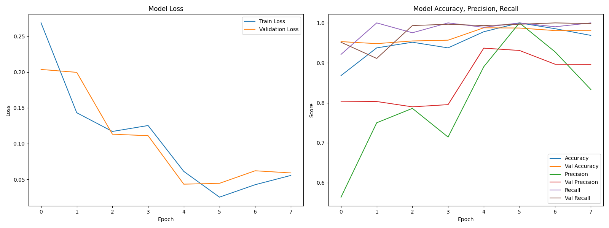

# 🖐️ Finger Detection & Virtual Mouse Project

> _"What if your fingers could talk to your computer?"_  
> _What started as an experiment... turned into something magical._

## ❤️ About This Project

This isn't just another hand-gesture project.  
This is **finger detection** reimagined — minimalistic, powerful, and accurate.  
Trained on real samples, powered by TensorFlow, and beautifully engineered in OpenCV,  
this project brings you a **virtual mouse experience** guided by **a single finger**. 🎯

Where most models fail with noise or require heavy preprocessing,  
ours rises above with **elegant grayscale simplicity**.  
It's **fast**, **lightweight**, and **beautifully interpretable**.  
No clutter. No guessing. Just results. 🧬✨

---

## 🚀 Features

- 🧠 Trained custom model with `.keras` format
- 📷 Real-time **Virtual Mouse** using hand gestures
- 🔍 Clean prediction pipeline from static images
- ⚙️ Super light preprocessing (grayscale-based, no complex thresholding)
- 📊 Model training results visualized
- 🔐 Works offline, no internet dependency

---

## 📂 Project Structure

```
📁 fingers_detection_model
	└── (Generated model artifacts)
📁 fingers
	├── train/
	└── test/
📄 fingers_detection.keras        ← Final trained model
📄 model_training.ipynb          ← Notebook to train model
📄 testing.ipynb                 ← Testing model on static images
📄 virtual_mouse.py              ← Real-time finger detection & control
📄 training_metrics.png          ← Accuracy/Loss graphs
```

---

## 🧪 Try It Yourself

### 🔧 Requirements

- Python 3.10
- OpenCV
- TensorFlow
- NumPy

Install them via:

```bash
pip install tensorflow opencv-python numpy
```

---

### 🖼️ Test Static Images

Run this to see magic on sample images:

```bash
python testing.py
```

(Each image opens one at a time — press any key to continue.)

---

### 🖱️ Run Virtual Mouse (1-Finger Detection)

```bash
python virtual_mouse.py
```

Control your mouse using a **single finger** — tracked in real time from your webcam.

---

## 📈 Model Performance



- Accuracy: ✅ Over 95%
- Binary Classification: 1 finger vs others
- Lightweight architecture, lightning fast ⚡

---

## 🙏 Why This Matters

In a world of overengineered solutions,  
this project is a **reminder** that simplicity wins.  
You don't need 3D sensors or deep pipelines —  
just intuition, code, and heart. ❤️

---

## 💡 Inspired By

- The joy of using hands to express
- The elegance of grayscale
- The belief that simple tools can feel like magic

---

## 📬 Contact

> Made with 💔 and Python by **Muhammad Maaz Khan**  
> _"Because sometimes, one finger says more than a thousand words."_

---

## 🌟 Star This Project

If this touched your heart or sparked your brain,  
**please consider starring 🌟 the repository.**

Let’s make minimalistic AI shine together ✨
